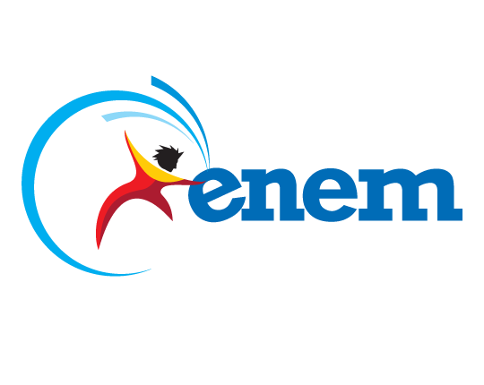

# Codenation Challenge

## Metas <code>[9/13]</code>

-   [X] Rodar com o autosklearn
-   [X] Usar apenas características selecionadas pelo KBest
-   [X] Gerar novas características [P] [V]
-   [X] Verificar se é possível usar o xgboost como regressor [P]
-   [X] Estimar parametros para os regressores mais relevantes
-   [X] Normalizar os dados antes de enviar para o regressor [P]
-   [X] Realizar teste com DNN
-   [X] Estudar métodos para eliminação de outliers
-   [X] Estudar métodos de Scale
-   [ ] Analisar individuos de alta precisão e baixa precisão no acerto com o Lime
-	[ ] Análise dos indivíduos utilizando ELI5
-   [ ] Analisar o gráfico da regressão
-	[ ] Rodar com o autosklearn utilizando os melhores regressores
-	[ ] Rodar com TPOT

## Análises estatísticas que podem ser relevantes <code>[90%]</code>

-   [X] Skew
-   [X] Kurtosis
-   [X] Quantile
-   [X] Median
-   [X] Mean
-   [X] Mode
-	[X] Mean Absolute Deviation
-	[X] Standard Error of the Mean
-	[X] Standard Deviation
-	[X] Variance
-	[X] Amplitute
-   [ ] Count

## Regressores mais relevantes

1.  XGBoost
2.  Random Forest
3.  ExtraTrees
